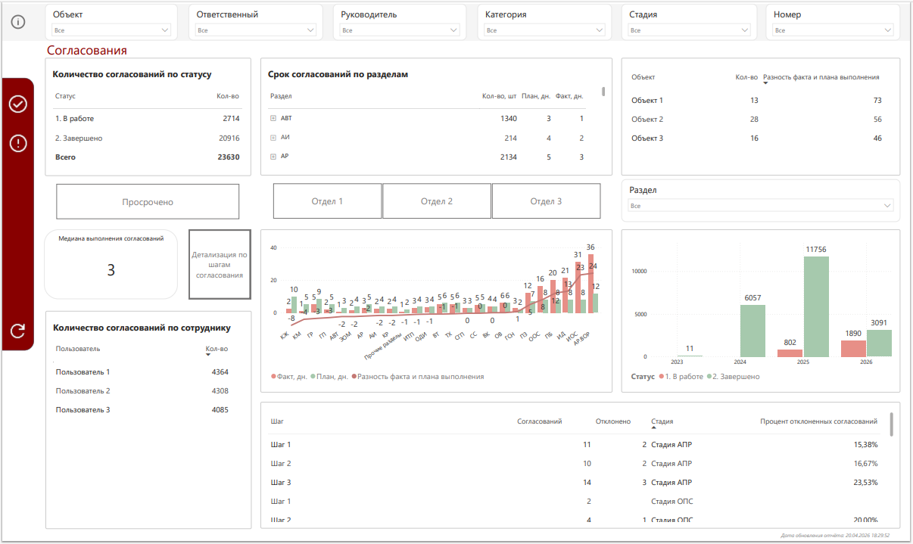
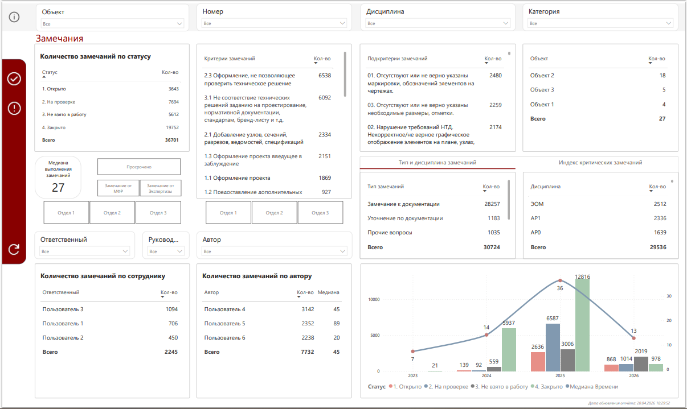

# CDE Analytics Dashboard (Common Data Environment)

## Overview

BI-решение для анализа процессов согласования документации и обработки замечаний в системе Common Data Environment (CDE) в строительных проектах.

Проект направлен на централизованный сбор, обработку и визуализацию данных по согласованиям и замечаниям, что позволяет анализировать эффективность процессов и выявлять узкие места.

---

## Business Problem

Отсутствие централизованной аналитики по процессам согласования:

* Данные распределены по различным сущностям системы (файлы, замечания, согласования)
* Отсутствует возможность оперативного анализа нагрузки сотрудников
* Невозможно эффективно оценить сроки согласования и качество документации
* Ручной анализ данных (50k+ записей) не масштабируется

---

## Goal

Создать BI-систему, которая:

* Консолидирует данные из различных источников CDE
* Позволяет анализировать процессы согласования и замечаний
* Обеспечивает прозрачность загрузки сотрудников
* Сокращает время анализа и принятия решений

---

## Data Sources

Используемые данные:

* `gstation_files.csv` — данные о файлах (автор, версии, даты)
* `gstation_issues.csv` — замечания (статусы, ответственные)
* `gstation_reviews_with_files.csv` — документы на согласовании
* `review_steps.csv` — этапы согласования
* `user_data.csv` — пользователи системы

Объем данных:

* > 50 000 замечаний
* > 23 000 согласований
* > 100 объектов

---

## Solution Architecture

Основные этапы реализации:

### 1. Data Extraction & ETL

* Подключение к источникам данных (MySQL, CSV)
* Регулярное извлечение данных
* Очистка и трансформация данных (Power Query)

### 2. Data Modeling

* Формирование модели данных для аналитики
* Определение бизнес-правил расчета метрик
* Связка таблиц (файлы, замечания, согласования, пользователи)

### 3. Data Analysis

* Анализ сроков согласований
* Анализ нагрузки на сотрудников
* Анализ качества документации

### 4. Data Visualization (Power BI)

* Разработка интерактивных дашбордов
* Реализация фильтров и drill-down / drill-through
* Использование DAX для расчета метрик

---

## Key Metrics & Analytics

* Количество согласований по статусам
* Количество замечаний по статусам
* Медианное время закрытия (согласования / замечания)
* Распределение нагрузки по сотрудникам
* Качество документации (процент отклонений)
* Динамика создания согласований и замечаний
* Анализ по объектам и разделам документации

---

## Dashboard Features

* Интерактивная фильтрация (объект, сотрудник, подразделение, статус)
* Drill-down (иерархии по времени)
* Drill-through (детализация до конкретных записей)
* Анализ нагрузки сотрудников
* Анализ сроков выполнения задач

---

## Technologies Used

* Power BI (визуализация, моделирование)
* DAX (расчет метрик)
* Power Query (ETL)
* SQL / MySQL (источник данных)

---

## Results & Business Impact

* +100 пользователей системы ежемесячно
* Сокращение времени поиска информации на **30%**
* Снижение количества ошибок на **25%**
* Повышение прозрачности процессов согласования
* Возможность анализа больших объемов данных (50k+ записей), ранее недоступная вручную

---

## What This Project Demonstrates

Соответствие требованиям BI Analyst (middle+):

✔ Сбор и подготовка данных из разных источников
✔ Работа с большим объемом данных
✔ Построение дашбордов под бизнес-задачи
✔ Использование Power BI + DAX
✔ Базовый ETL (Power Query)
✔ Анализ данных и поиск инсайтов
✔ Визуализация и storytelling
✔ Работа с метриками и KPI

---

## How to Run

1. Загрузить данные (CSV / подключение к БД)
2. Открыть Power BI файл
3. Обновить источник данных
4. Использовать фильтры и drill-down

---

## Screenshots

---

## Conclusion

Проект демонстрирует полный цикл BI-аналитики:
от сбора данных до визуализации и бизнес-анализа.

Основной акцент — анализ процессов согласования и повышение прозрачности работы в CDE.
