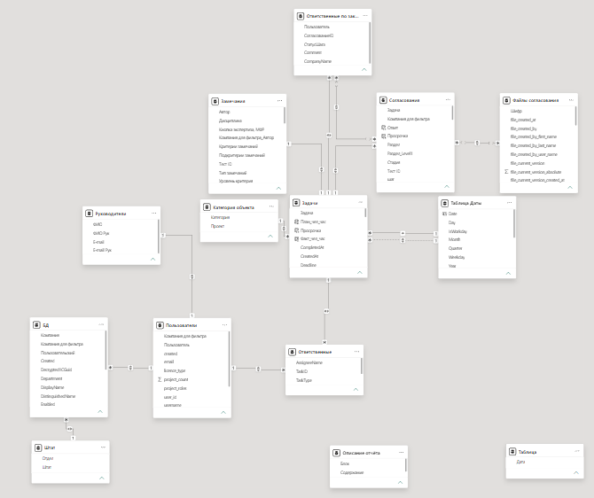

# BI Аналитика CDE: Дашборд процессов согласования и замечаний

## Обзор проекта

BI-решение для анализа процессов согласования документации и обработки замечаний в системе Common Data Environment (CDE) в строительных проектах.

Проект реализует централизованный сбор, подготовку и визуализацию данных по согласованиям и замечаниям, обеспечивая прозрачность процессов и возможность выявления узких мест.

---

## Бизнес-задача

Отсутствие централизованной аналитики по процессам согласования:

* Данные распределены по нескольким сущностям (файлы, замечания, согласования)
* Нет оперативного контроля нагрузки сотрудников
* Нет прозрачной оценки сроков согласования
* Ручной анализ не масштабируется (50k+ записей)

---

## Цель проекта

* Консолидировать данные из различных источников CDE
* Обеспечить аналитическую прозрачность процессов согласования
* Сократить время анализа данных
* Повысить управляемость процессов и качество документации

---

## Используемые данные

* `gstation_files.csv` — файлы (автор, даты, версии)
* `gstation_issues.csv` — замечания
* `gstation_reviews_with_files.csv` — документы на согласовании
* `review_steps.csv` — этапы согласования
* `user_data.csv` — пользователи

Объем данных:

* > 50 000 замечаний
* > 23 000 согласований
* > 100 объектов

---

## Архитектура решения

### 1. Сбор и подготовка данных (ETL)

* Подключение к MySQL и CSV
* Очистка и трансформация данных (Power Query)
* Регулярное обновление данных

### 2. Моделирование данных

* Формирование аналитической модели
* Определение бизнес-логики метрик
* Связь сущностей: согласования, замечания, пользователи, объекты
* Подготовка данных для аналитики и self-service BI

### 3. Анализ данных

* Анализ сроков согласования
* Анализ загрузки сотрудников
* Анализ качества документации

### 4. Визуализация (Power BI)

* Интерактивные дашборды
* Drill-down / Drill-through
* DAX-метрики

---

## Модель данных (Data Modeling)

Тип модели: аналитическая (приближенная к Star Schema)

* Факты:

  * согласования
  * замечания

* Измерения:

  * пользователи
  * объекты
  * даты
  * разделы документации

Модель позволяет агрегировать данные и выполнять многомерный анализ.

---

## Ключевые метрики

* Количество согласований по статусам
* Количество замечаний по статусам
* Медианное время закрытия
* Нагрузка на сотрудников
* Процент отклонений документации
* Динамика процессов во времени

---

## Инсайты (Business Insights)

* Выявлены этапы согласования с увеличенным временем обработки
* Обнаружена неравномерная загрузка сотрудников
* Найдены объекты с повышенным количеством замечаний
* Выявлены разделы документации с повышенным процентом отклонений
* Определены периоды пиковых нагрузок

Использование:

* перераспределение нагрузки
* контроль сроков
* повышение качества документации

---

## Функциональность дашборда

* Фильтрация (объект, сотрудник, статус)
* Drill-down по времени
* Drill-through детализация
* Анализ нагрузки
* Анализ сроков

---

## Используемые технологии

* Power BI
* DAX
* Power Query (ETL)
* SQL (извлечение и подготовка данных)
* MySQL

---

## Результаты и эффект

* +100 пользователей системы ежемесячно
* Сокращение времени поиска информации на 30%
* Снижение количества ошибок на 25%
* Повышение прозрачности и управляемости процессов
* Анализ больших объемов данных (50k+ записей)

---

## Как запустить

1. Подключить источники данных
2. Открыть Power BI файл
3. Обновить данные
4. Использовать фильтры и детализацию

---

## Скриншоты

---

## Вывод

Проект реализует полный цикл BI-аналитики: от сбора данных до построения дашбордов и получения инсайтов.

Основной результат — повышение прозрачности процессов согласования и возможность анализа больших объемов данных.
